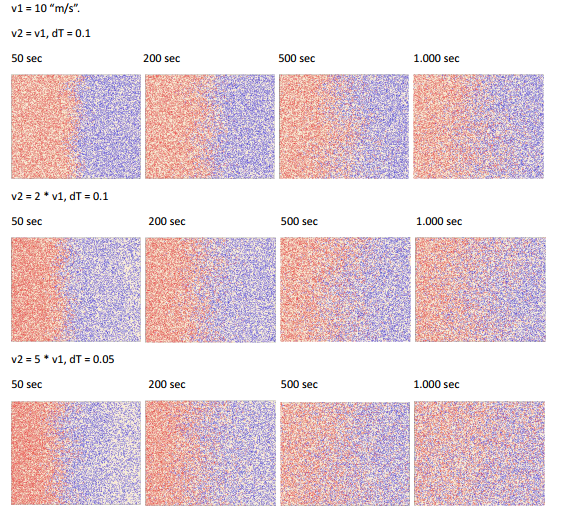
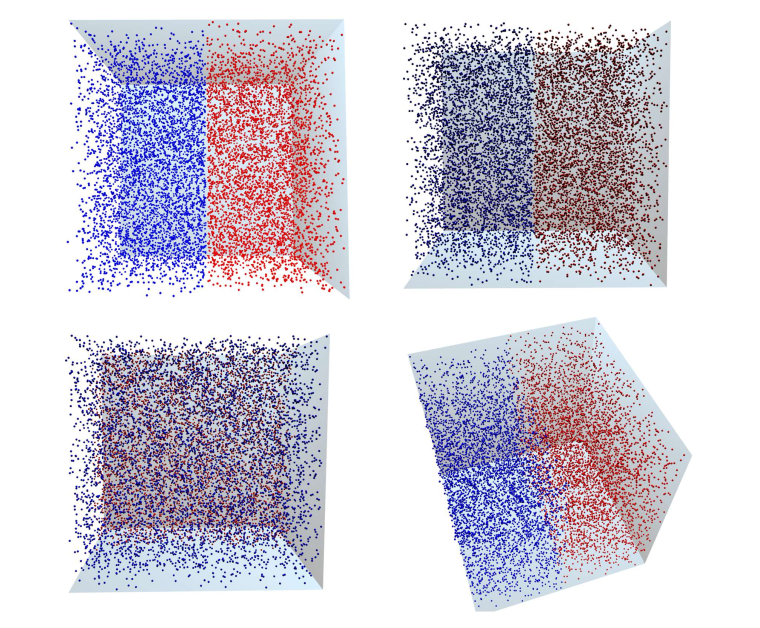
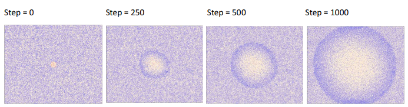
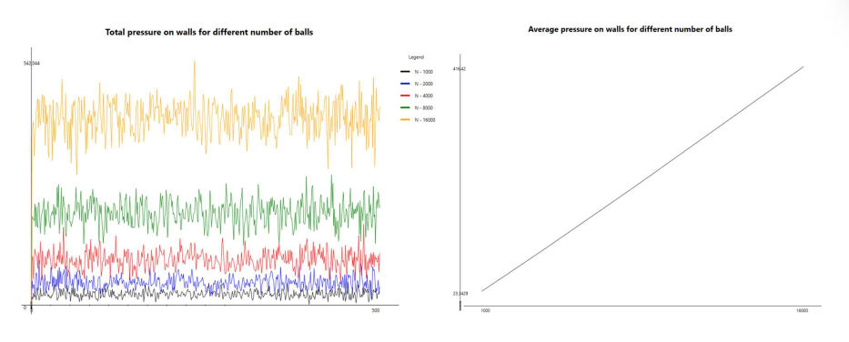
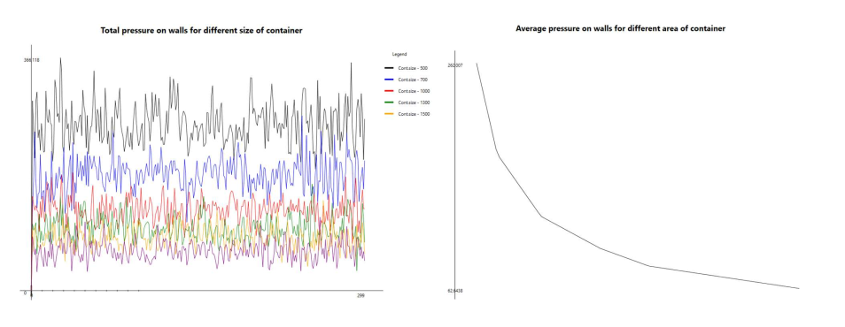
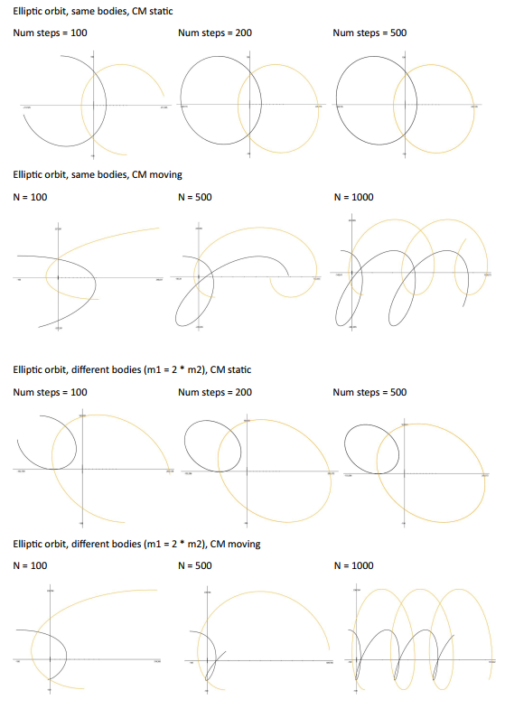
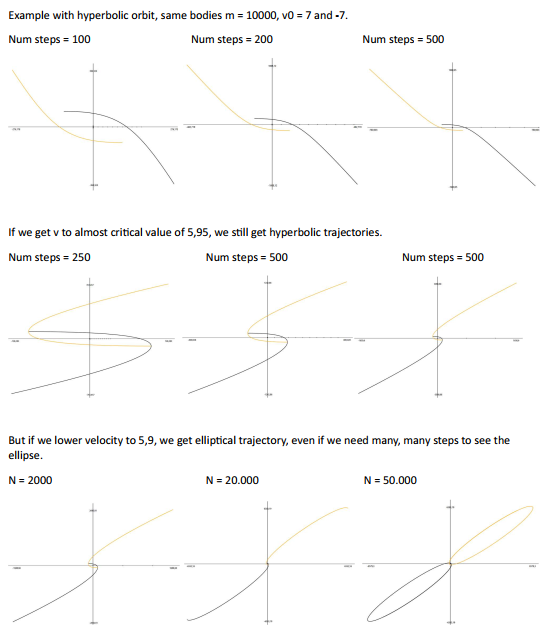
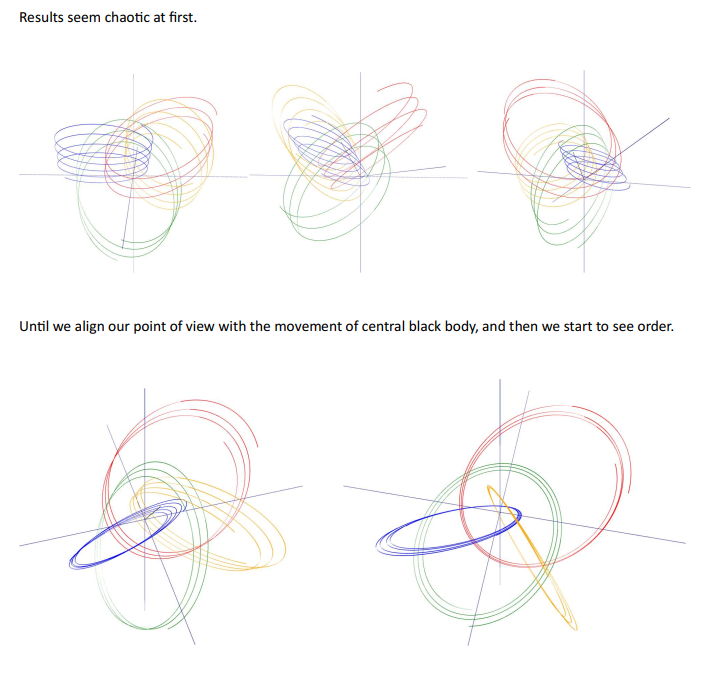

# Exploring Physics with C++
## Table of Contents
1. [Introduction](#introduction)
2. [Installation](#installation)
3. [Images of simulations from the book](#Images__of_simulations_from_the_book)
4. [Programs by chapters](#Programs_by_chapters)

## Introduction

This repository is a website for my forthcoming book "Exploring Physics with C++" (now in version 0.5).

In folder Book you will find latest PDF (draft) version of the book.

In the folder Code you will find the source code for the programs in the book.

## Installation

To try out the programs, simply clone the repository to your local machine by the method of your choosing, and open folder Code with Visual Studio Code (or Visual Studio on Windows).

## Images of simulations from the book

CollisionSimulator2D - mixing gasses in 2D

CollisionSimulator3D - Mixing gasses in 3D

Shockwave in 2D - 100 energetic particles in the middle of the box, creating a shockwave

Dependence of pressure on N (number of balls/molecules in 2D gas simulation)

Dependence of pressure on V (volume of the box in 2D gas simulation)

Gravity in 2D - examples of elliptical orbits

Gravity in 2D - examples of hyperbolical orbits

Gravity in 3D - orbits of five bodies, with one body in the center and four orbiting it

## Programs by chapters

Chapters worth looking at are:

- [Ch01 - Basic objects](/Code/Chapter_01_basic_objects/main_chapter_01.cpp) - example use of vectors, matrices, functions and geometry objects
- [Ch02 - Vizualizers](/Code/Chapter_02_vizualization/main_chapter_02.cpp) - example usage of visualizers
- [Ch03 - Basic algorithms](/Code/Chapter_03_basic_algorithms/main_chapter_02.cpp) - example usage of derivation, integration, root finding, and interpolation algorithms
- [Ch04 - Collision simulator](/Code/Chapter_04_collision_simulator_/main_chapter_04.cpp) - collision simulator in 2D and 3D
- [Ch05 - Simple pendulum](/Code/Chapter_05_pendulum/main_chapter_05.cpp) - solving simple pendulum
- [Ch06 - Double and spherical pendulum](/Code/Chapter_06_double_and_spherical_pendulum/main_chapter_06.cpp) - solving double and spherical pendulum
- [Ch08 - Gravity](/Code/Chapter_08_gravity/main_chapter_08.cpp) - investigating gravity
- [Ch09 - N-body gravity problem](/Code/Chapter_09_gravity_N_body_problem/main_chapter_09.cpp) - N-body gravity problem simulation
- [Ch13 - Rigid body](/Code/Chapter_13_rigid_body/main_chapter_13.cpp) - calculating moments of inertia for discrete and continuous masses, verifying tensor transformations

